Note: **I am a Data Scientist in the Bay Area!  Feel free to contact me with questions, comments, offers for work ;)**

-   [trevor.m.murphy@gmail.com](mailto:trevor.m.murphy@gmail.com)
-   [LinkedIn](https://www.linkedin.com/in/trevor-murphy-49ba1421)
-   [GitHub](https://github.com/tmurph)
-   [Résumé](resume.pdf)

# Data Analysis of Health Insurance in Florida

This contains the code and resources for my final project for [Signal Data Science, Spring 2016 Cohort](http://signaldatascience.com/).  

Via [Kaggle](https://www.kaggle.com/hhsgov/health-insurance-marketplace), I study the published health insurance rates made available from the Centers for Medicare and Medicaid Services.  I infer the underlying rating model using linear fixed effects modeling, then I look for drivers of rating variability among public health and demographics data using cross-validated lasso regression.  

Surprisingly, *no* non-trivial correlations are found between insurance rates and any of the available data.  I discuss the practical implications of this null result.

An [appendix](#appendix-code) at the end contains all my code, with context.  The code is separately available [here (data processing, R)](final-project.R), [here (graphics, R)](final-project-graphics.R), and [here (data processing, SQL)](final-project.sqlite.script).

# Individual Health Insurance Primer

To start us off, consider price discrimination.  It’s been the boon of profit-maximizing producers and the bane of hapless consumers everywhere since Econ 101.  You’ll be happy to hear that the practice is explicitly restrained by both state and federal legislation.  Hooray!  

“Hooray!  Because health insurance should be affordable to all!” I hear the voices cry—and they’re right!  Historically speaking, though, demands for regulation came from very different voices.<sup><a id="fnr.1" class="footref" href="#fn.1">1</a></sup>  Regardless, we now live in a world where insurance companies do not price according to textbook theories.

Given that background, how do insurers actually set their prices?

To investigate this question empirically, let’s analyze the public pricing information of Florida&rsquo;s two largest health insurance carriers in conjunction with publicly available health and demographic information.  Given the weakness of most Econ 101 assumptions in the health insurance market, we should expect different carriers’ pricing strategies will correlate weakly, or not at all.

# Data and Analysis

The Centers for Medicare and Medicaid Services (CMS) releases public use files of health insurance benefits and rates for many states and plans.  Out of fondness for a former employer, I’ll compare Blue Cross Blue Shield of Florida (BCBSFL) with a competitor, UnitedHealthcare (United).

## Health Insurance Rates from Kaggle

While the ultimate sources of the data are CMS and the insurance carriers, Kaggle provides<sup><a id="fnr.2" class="footref" href="#fn.2">2</a></sup> an organized database of all the data as well as supporting code.  It’s quite a lot of data, so I’ll use `SQL` to extract just a subset of the individual pricing information then process the results into an `R` dataframe.  

Here’s the head of the `R` dataframe.  The actual `SQL` and `R` code is provided in the [appendix](#pulling-data-from-kaggle). 

<table align="center" border="2" cellspacing="0" cellpadding="6" rules="groups" frame="hsides">


<colgroup>
<col  class="org-right" />

<col  class="org-right" />

<col  class="org-left" />

<col  class="org-left" />

<col  class="org-right" />

<col  class="org-right" />

<col  class="org-right" />

<col  class="org-left" />
</colgroup>
<thead>
<tr>
<th scope="col" class="org-right">&#xa0;</th>
<th scope="col" class="org-right">IndividualRate</th>
<th scope="col" class="org-left">PlanId</th>
<th scope="col" class="org-left">RatingAreaId</th>
<th scope="col" class="org-right">Age</th>
<th scope="col" class="org-right">IssuerId</th>
<th scope="col" class="org-right">AgeNum</th>
<th scope="col" class="org-left">IssuerName</th>
</tr>
</thead>

<tbody>
<tr>
<td class="org-right">1</td>
<td class="org-right">188.73</td>
<td class="org-left">16842FL0070073</td>
<td class="org-left">Rating Area 1</td>
<td class="org-right">0-20</td>
<td class="org-right">16842</td>
<td class="org-right">20</td>
<td class="org-left">BCBSFL</td>
</tr>


<tr>
<td class="org-right">2</td>
<td class="org-right">297.21</td>
<td class="org-left">16842FL0070073</td>
<td class="org-left">Rating Area 1</td>
<td class="org-right">21</td>
<td class="org-right">16842</td>
<td class="org-right">21</td>
<td class="org-left">BCBSFL</td>
</tr>


<tr>
<td class="org-right">3</td>
<td class="org-right">297.21</td>
<td class="org-left">16842FL0070073</td>
<td class="org-left">Rating Area 1</td>
<td class="org-right">22</td>
<td class="org-right">16842</td>
<td class="org-right">22</td>
<td class="org-left">BCBSFL</td>
</tr>


<tr>
<td class="org-right">4</td>
<td class="org-right">297.21</td>
<td class="org-left">16842FL0070073</td>
<td class="org-left">Rating Area 1</td>
<td class="org-right">23</td>
<td class="org-right">16842</td>
<td class="org-right">23</td>
<td class="org-left">BCBSFL</td>
</tr>


<tr>
<td class="org-right">5</td>
<td class="org-right">297.21</td>
<td class="org-left">16842FL0070073</td>
<td class="org-left">Rating Area 1</td>
<td class="org-right">24</td>
<td class="org-right">16842</td>
<td class="org-right">24</td>
<td class="org-left">BCBSFL</td>
</tr>


<tr>
<td class="org-right">6</td>
<td class="org-right">298.4</td>
<td class="org-left">16842FL0070073</td>
<td class="org-left">Rating Area 1</td>
<td class="org-right">25</td>
<td class="org-right">16842</td>
<td class="org-right">25</td>
<td class="org-left">BCBSFL</td>
</tr>
</tbody>
</table>

## Rate Data Model

Actuaries may model insurance rates as a product of various factors, with each factor determined by analysis of company data.  A typical formula for the rate 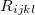 of plan  in county  for subscribers age 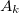 on insurance carrier 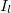 might look like this.


<div class="figure">
<p>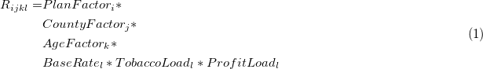</p>
</div>

After taking logs of both sides, 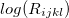 is expressed as the sum of fixed effects by plan, county, subscriber age, and insurance carrier.  For each insurance carrier we’ll fit such a model with the `lfe` package.  Here’s the relevant code.

```R
library(lfe)

## In the language of the lfe package, the "|" symbol separates
## regressors (on the left) from fixed effect groupings (on the right).

## For this model, log(Rate) is modeled entirely as a sum of fixed effects,
## with no non-trivial regression terms.
model.formula <- log(IndividualRate) ~ 1 | PlanId + RatingAreaId + Age

## Loop with lapply / combine with rbind.
effects.df <- levels(df$IssuerName) %>% 
    lapply(function(name) {
        df %>%
            filter(IssuerName == name) %>%
            felm(formula=model.formula) %>%
            getfe() %>%
            select(fe, idx, effect) %>%
            mutate(issuer=name) %>%
            return()
    }) %>%
    do.call(what=rbind)
```

The `effects.df` dataframe needs additional massaging to extract retrodictions of the individual rates, , but I’m eliding that here.  Full working code is provided in the [appendix](#fitting-the-models).

Now let’s see that the fixed effects model does, in fact, accurately describe the data. Here’s a plot of rate data for BCBSFL for a few sampled plans and counties.

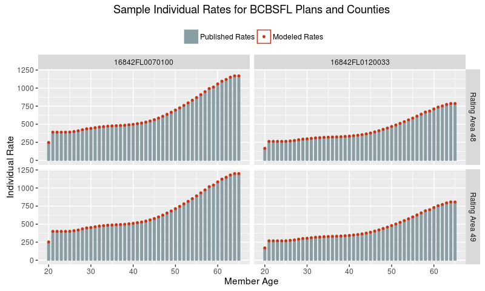

What, a perfect fit?!  That’s actually expected, because there is no underlying uncertainty in the process that generated these published rates.  They were produced by humans following the simple [Formula 1](#orgdrawer1) above, so this plot demonstrates that we have accurately inferred the unpublished factors (the right hand side of the formula) from the published rates (the left hand side).

With that out of the way, for the remainder of this analysis I’ll focus explicitly on the county effects.

## Baseline Analysis

If market and regulatory forces drove major carriers to adopt similar pricing strategies across the state, then we would expect to see strong correlations between the carriers&rsquo; county effects.  As a quick sanity check let’s fit a linear model of United factors on BCBSFL factors.

    lm(formula = scale(United) ~ scale(BCBSFL), data = florida.county.factors)
                  coef.est coef.se
    (Intercept)   0.00     0.11   
    scale(BCBSFL) 0.36     0.12   
    ---
    n = 67, k = 2
    residual sd = 0.94, R-Squared = 0.13

The estimated coefficient is significant at the 0.01 level, so it’s unlikely that there’s literally no underlying correlation between the rating factors.  That said, any such correlation points to a weak effect, since the model only explains 13% of the variation of United’s rating factors.

We can also see this result graphically.

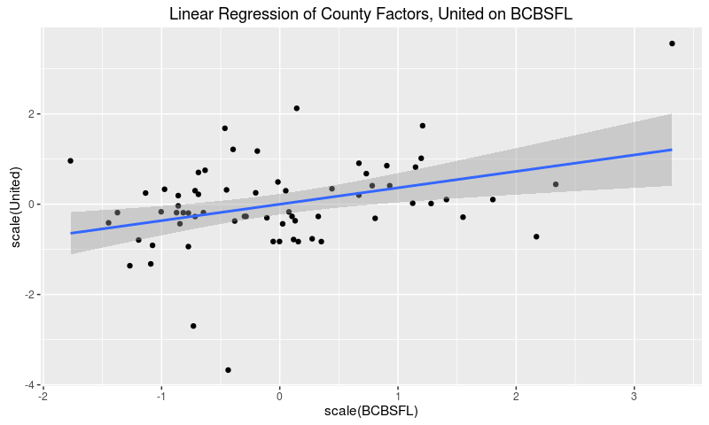

Voilà!  The two sets of effects do correlate a bit, but with plenty of variation left to explain.  In particular, careful observation indicates that United factors cluster around the mean with three outliers, while BCBSFL factors show more dispersion.

To understand that remaining variation, let’s pull down Floridian public health data by county and fit regularized linear models for each set of factors.  I’ll use 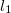 / lasso regularization, because in each case I want to isolate those few data variables that are most strongly predictive of the rating factors.

## Public Health Data

The Florida Department of Health tracks<sup><a id="fnr.3" class="footref" href="#fn.3">3</a></sup> health and environmental data by county for many diseases, conditions, and health-related metrics.  For this analysis I pulled as much as I could:

-   age-adjusted cancer incidence from 2002 through 2011 for many cancers
-   incidence of premature births and low-weight births from 2005 through 2014
-   available health metrics such as rates of heart attack, obesity, and smoking
-   other relevant factors such as rates of poverty, incidence of enteric disease outbreaks, and self-reported health status

The same department also provides<sup><a id="fnr.4" class="footref" href="#fn.4">4</a></sup> demographic data through their FloridaCHARTS program.  For this analysis I pulled demographics as of 2014, the most recent year available without estimation.

As always, full code is provided in the [appendix](#pulling-data-from-dept-of-health).

## Rates for United Healthcare

The following code uses the `glmnet` library to fit a cross-validated lasso regression of United rating factors on all available public health data.  A table of non-zero regression coefficients immediately follows the code.

```R
library(glmnet)

X.United <- model.matrix(United ~ . - BCBSFL, normalized.data)
Y.United <- model.frame(United ~ . - BCBSFL, normalized.data) %>% model.response()
coef.United <- cv.glmnet(X.United, Y.United, nfolds=nrow(normalized.data)) %>%
    coef(s="lambda.1se")
```

<table id="orgtable1" align="center" border="2" cellspacing="0" cellpadding="6" rules="groups" frame="hsides">
<caption class="t-bottom"><span class="table-number">Table 1:</span> United LASSO regression</caption>

<colgroup>
<col  class="org-left" />

<col  class="org-right" />
</colgroup>
<thead>
<tr>
<th scope="col" class="org-left">Term</th>
<th scope="col" class="org-right">Coefficient</th>
</tr>
</thead>

<tbody>
<tr>
<td class="org-left">cancer.bladder.2008</td>
<td class="org-right">-0.034</td>
</tr>


<tr>
<td class="org-left">cancer.breast50.2006</td>
<td class="org-right">-0.013</td>
</tr>


<tr>
<td class="org-left">cancer.kidney.2007</td>
<td class="org-right">-0.017</td>
</tr>


<tr>
<td class="org-left">cancer.liver.2007</td>
<td class="org-right">-0.112</td>
</tr>


<tr>
<td class="org-left">cancer.lymphoma.2007</td>
<td class="org-right">-0.023</td>
</tr>


<tr>
<td class="org-left">cancer.lymphoma.2011</td>
<td class="org-right">-0.038</td>
</tr>


<tr>
<td class="org-left">cancer.pancreas.2010</td>
<td class="org-right">-0.089</td>
</tr>


<tr>
<td class="org-left">salmonella.2012</td>
<td class="org-right">-0.012</td>
</tr>
</tbody>
</table>

We can’t directly interpret the magnitude of the coefficients, unfortunately, because we normalized the regression variables.  The negative signs, though, mean higher incidence of these conditions are predicting lower county rating factors.

Let me repeat that: some **higher** cancer rates in the late 2000s are predicting **lower** health insurance rates in 2016.

This defies naive causal intuition—why would a health insurer respond to increased cancer risk with lower rates?—so let’s dive deeper into the numbers.

Since three predictive cancer variables are from 2007, let’s see the overall cancer incidence by county from that year.

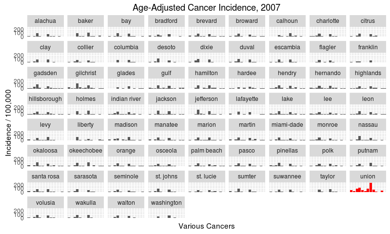

I’ve highlighted Union as a clear outlier, with higher-than-average incidence rates across many cancers, especially of the lung.  Union county may be an outlier because it has the greatest proportion of males in its population.  Sadly, age-and-sex-adjusted cancer rates were too hard to come by for this analysis.

Now let’s see United’s rate relativities by county.

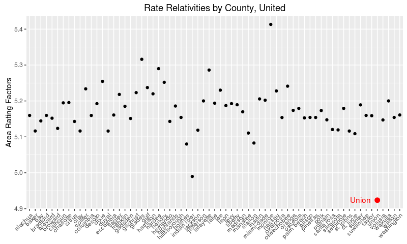

Again, I’ve highlighted Union county as a clear outlier.  

As a matter of fact, when we drop Union’s cancer incidence from the data and re-run the lasso [above](#orgsrcblock1), *no regression terms remain*.  I conclude that there is not much predictive power to be found in the available health and demographic factors, and that [Table 1](#orgtable1) shows spurious correlations driven by Union County.

## Rates for Blue Cross Blue Shield of Florida

Wait for it…

…

…

Surprisingly to this author, the data tells the same story for BCBSFL.  When we fit a lasso using similar [code](#orgsrcblock1), *mutatis mutandis*, we see the following regression terms.

<table id="orgtable2" align="center" border="2" cellspacing="0" cellpadding="6" rules="groups" frame="hsides">
<caption class="t-bottom"><span class="table-number">Table 2:</span> BCBSFL LASSO regression</caption>

<colgroup>
<col  class="org-left" />

<col  class="org-right" />
</colgroup>
<thead>
<tr>
<th scope="col" class="org-left">Term</th>
<th scope="col" class="org-right">Coefficient</th>
</tr>
</thead>

<tbody>
<tr>
<td class="org-left">birth.low.weight.2005</td>
<td class="org-right">-0.051</td>
</tr>


<tr>
<td class="org-left">birth.low.weight.2010</td>
<td class="org-right">-0.109</td>
</tr>


<tr>
<td class="org-left">birth.preterm.2013</td>
<td class="org-right">0.192</td>
</tr>


<tr>
<td class="org-left">birth.very.low.weight.2008</td>
<td class="org-right">-0.214</td>
</tr>


<tr>
<td class="org-left">birth.very.low.weight.2010</td>
<td class="org-right">0.138</td>
</tr>


<tr>
<td class="org-left">birth.very.preterm.2014</td>
<td class="org-right">-0.116</td>
</tr>


<tr>
<td class="org-left">cancer.brain.2011</td>
<td class="org-right">0.027</td>
</tr>


<tr>
<td class="org-left">cancer.breast50.2003</td>
<td class="org-right">0.13</td>
</tr>


<tr>
<td class="org-left">cancer.breast50.2004</td>
<td class="org-right">0.068</td>
</tr>


<tr>
<td class="org-left">cancer.breast50.2006</td>
<td class="org-right">-0.02</td>
</tr>


<tr>
<td class="org-left">cancer.kidney.2007</td>
<td class="org-right">-0.033</td>
</tr>


<tr>
<td class="org-left">cancer.leukemia.2009</td>
<td class="org-right">0.109</td>
</tr>


<tr>
<td class="org-left">cancer.liver.2004</td>
<td class="org-right">0.125</td>
</tr>


<tr>
<td class="org-left">cancer.lung.2007</td>
<td class="org-right">-0.14</td>
</tr>


<tr>
<td class="org-left">cancer.lung.2008</td>
<td class="org-right">-0.028</td>
</tr>


<tr>
<td class="org-left">cancer.lung.2010</td>
<td class="org-right">-0.299</td>
</tr>


<tr>
<td class="org-left">cancer.lymphoma.2005</td>
<td class="org-right">0.005</td>
</tr>


<tr>
<td class="org-left">cancer.melanoma.2010</td>
<td class="org-right">0.043</td>
</tr>


<tr>
<td class="org-left">cancer.mesothelioma.2003</td>
<td class="org-right">0.099</td>
</tr>


<tr>
<td class="org-left">cancer.pancreas.2004</td>
<td class="org-right">0.014</td>
</tr>


<tr>
<td class="org-left">cancer.thyroid.2007</td>
<td class="org-right">0.058</td>
</tr>


<tr>
<td class="org-left">ecoli.2005</td>
<td class="org-right">0.076</td>
</tr>


<tr>
<td class="org-left">ecoli.2008</td>
<td class="org-right">0.181</td>
</tr>


<tr>
<td class="org-left">heart.er.2010</td>
<td class="org-right">0.106</td>
</tr>


<tr>
<td class="org-left">poverty5.2010</td>
<td class="org-right">-0.025</td>
</tr>


<tr>
<td class="org-left">poverty65.2010</td>
<td class="org-right">0.117</td>
</tr>


<tr>
<td class="org-left">salmonella.2004</td>
<td class="org-right">-0.018</td>
</tr>


<tr>
<td class="org-left">pop.2014.Hispanic</td>
<td class="org-right">0.004</td>
</tr>
</tbody>
</table>

Yet, when we remove  Union’s cancer incidence, **all regression terms vanish**.

## Conclusion

I will be the first to admit that this null result surprises me so powerfully, I smell a problem with the analysis.  However, I’ve reviewed my assumptions, broken out my intermediate steps, and heeded the advice of the data science experts at [Signal](http://signaldatascience.com/).  Full modeling code is available in the [appendix](#modeling-relativities-with-the-lasso) for all to see.  At this point, I must conclude that the rates of major health insurers simply do not vary in a predictable way with local health profiles.  At least for these two companies in Florida.

So what **does** drive the variance in prices?  Well, stay tuned for Part 2, and have a look at this graph in the meantime:

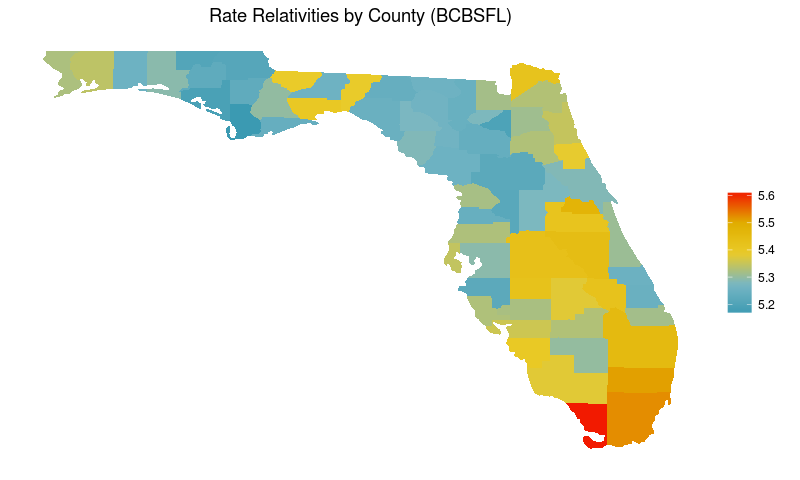

# Appendix: Code

## Pulling Data from Kaggle

The Kaggle datasets<sup><a id="fnr.2.100" class="footref" href="#fn.2">2</a></sup> are huge; this `SQL` grabs just the rows we want.  It takes a while to run on my laptop, so I save the results to csv.

```sqlite
-- The open enrollment period for individual insurance spans several months,
-- but nevertheless all rates are "effective" as of January 1.
with filtered_rate as (
    select *
    from Rate
    where
        RateEffectiveDate = "2016-01-01"
        and StateCode = "FL"
)

-- There's too much data available on individual plans offered through the
-- health exchange, so we'll restrict to just the so-called "Silver" plans.

-- By law, plans are rated "Bronze", "Silver", "Gold", or "Platinum" to
-- (roughly) characterize the level of insurance coverage the plan provides.
-- Silver plans have become a go-to level for intra-company comparisons.
, filtered_plan as (
    select *
    from PlanAttributes
    where
        MetalLevel = "Silver"
        and MarketCoverage = "Individual"
        and CSRVariationType like "%On Exchange%"
)

select
    r.*
from
    filtered_rate r
inner join
    filtered_plan p
on
    r.PlanId = p.StandardComponentId
    and r.BusinessYear = p.BusinessYear
;
```

And now with a little `R` we’re ready to analyze the data.

```R
library(readr)
library(dplyr)


## The rate data includes many fields we don't need for this analysis.
## Select just the rates by plan, county, age, and issuer.
df <- read_csv("data/rate-data.csv") %>%
    select(c(IndividualRate,                                 
             PlanId,                        
             RatingAreaId,                                   
             Age,                                      
             IssuerId))

## The Age information comes to us with some non-numeric strings.
## This gives us an equivalent numeric field, AgeNum, for later plotting.
df$AgeNum <- df$Age %>%
    sapply(FUN=function(.x) {
        switch(.x,
               "0-20"="20",
               "65 and over"="65",
               .x)   
    }) %>%
    as.numeric

## Issuer information comes to us as a federally-assigned ID number.
## This gives us the issuer names and mnemonics to work with instead.
df$IssuerName <- df$IssuerId %>%
    as.character %>%
    sapply(FUN=function(.id) {
        switch(.id,
               "16842"="BCBSFL",
               "68398"="United",
               "30252"="FB.HMO",
               "21663"="Celtic",
               "56503"="FHCP",
               "27357"="Health.First",
               "35783"="Humana",
               "57451"="Coventry",
               "54172"="Molina",
               "18628"="Aetna")
    })

## Most variables should be treated as factors.
for (var in c("PlanId", "RatingAreaId", "IssuerId", "IssuerName", "Age")) {
    df[[var]] <- factor(df[[var]])
}
```

## Fitting the Models

The following code extracts the plan, county, and age effects for each of the ten insurance issuers in Florida and builds a dataframe of the results.

```R
library(lfe)

## In the language of the lfe package, the "|" symbol separates
## regressors (on the left) from fixed effect groupings (on the right).

## For this model, log(Rate) is modeled entirely as a sum of fixed effects,
## with no non-trivial regression terms.
model.formula <- log(IndividualRate) ~ 1 | PlanId + RatingAreaId + Age

## Loop with lapply / combine with rbind.
effects.df <- levels(df$IssuerName) %>% 
    lapply(function(name) {
        df %>%
            filter(IssuerName == name) %>%
            felm(formula=model.formula) %>%
            getfe() %>%
            select(fe, idx, effect) %>%
            mutate(issuer=name) %>%
            return()
    }) %>%
    do.call(what=rbind)
```

From these results, we construct retrodictions of the individual rate at the plan-county-age-issuer level.

```R
## To build a prediction for each issuer's rating observation, we need to sum
## the modeled effects and exponentiate the result.

## The effects.df comes in "tidy" or "long" form, but we need to transform it
## to a "messy" or "wide" form to calculate the exponentiated sum.

## Split effects.df on the fixed effect groups and join the results together.
wide.effects.df <- levels(effects.df$fe) %>%
    lapply(FUN=function(effect.group) {
        filter(effects.df, fe == effect.group)
    }) %>%
    Reduce(f=function(x, y){merge(x, y, by="issuer")})

## Horizontally aggregate the indices and effects.
agg.indices <- wide.effects.df %>%
    select(issuer, starts_with("idx")) %>%
    c(sep=".") %>%
    do.call(what=paste)
agg.effects <- wide.effects.df %>%
    select(starts_with("effect")) %>%
    rowSums() %>%
    exp()
agg.df <- data.frame(index=agg.indices,
                     ModeledRate=agg.effects,
                     stringsAsFactors=F)

## Create an equivalent index in the original data frame.
df2 <- df
df2$index <- df2 %>%
    select(IssuerName, Age, PlanId, RatingAreaId) %>%
    c(sep=".") %>%
    do.call(what=paste)

## Join the two together.
data.with.predict <- left_join(df2, agg.df, by="index") %>%
    select(-c(index))
```

## Pulling Data from Dept of Health

The Florida Department of Health datasets<sup><a id="fnr.3.100" class="footref" href="#fn.3">3</a></sup><sup>, </sup><sup><a id="fnr.4.100" class="footref" href="#fn.4">4</a></sup> come in Excel spreadsheet format.  Downloaded files were exported to csv and given standardized names.  Sorry there’s no script for this part.

```R
library(reshape2)

## The csv referenced in this code contains the federally specified mapping of
## rating area numbers to county names.  The mapping's available online.
florida.county.factors <- effects.df %>%
    filter(fe == "RatingAreaId") %>%
    dcast(idx ~ issuer, value.var="effect") %>%
    merge(y=read_csv("data/govt-rating-areas.csv"),
          by.x="idx", by.y="Rating Area ID", all=T)

## All counties are (by construction) spelled canonically in this data.
## Just convert to lowercase.
florida.county.factors$County <- florida.county.factors$County %>%
    tolower()

## All files were downloaded from the Florida Department of Health's
## FloridaCHARTS website:
## http://www.floridacharts.com/flquery/population/populationrpt.aspx

florida.demo.files <- c("data/fl-demo-population.csv",
                        "data/fl-demo-pop-age.csv",
                        "data/fl-demo-pop-sex.csv",
                        "data/fl-demo-pop-race.csv",
                        "data/fl-demo-pop-ethnic.csv")

## Give the data frames meaningful names.
florida.demo.data <- Map(florida.demo.files,
                         f=function(file) {
                             return(read_csv(file, na=c("", "NA", "*")))
                         })
names(florida.demo.data) <- florida.demo.files %>%
    gsub(pattern="^data/fl-demo-", replacement="") %>%
    gsub(pattern=".csv$", replacement="") %>%
    gsub(pattern="-", replacement=".")

## Merge all the frames together by county.
florida.demo.summ <- names(florida.demo.data) %>%
    lapply(FUN=function(nam) {
        dat <- florida.demo.data[[nam]]
        names(dat) <- names(dat) %>%
            sub(pattern="^", replacement="pop.2014.") %>%
            sub(pattern="pop.2014.County", replacement="County")
        return(dat)
    }) %>%
    Reduce(f=function(x, y){return(merge(x, y, by="County"))})

## Some counties are spelled multiple ways "in the wild".
## Switch to canonical names.
florida.demo.summ$County <- florida.demo.summ$County %>%
    tolower() %>%
    lapply(FUN=function(cnty){
        return(switch(cnty,
                      "saint johns"="st. johns",
                      "saint lucie"="st. lucie",
                      cnty))
    }) %>%
    as.character()

## All files were downloaded from the Florida Department of Health's
## Environmental Public Health Tracking website:
## http://www.floridatracking.com/HealthTrackFL/default.aspx

florida.tracking.files <- c("data/fl-track-birth-low-weight.csv",
                            "data/fl-track-birth-preterm.csv",
                            "data/fl-track-birth-very-low-weight.csv",
                            "data/fl-track-birth-very-preterm.csv",
                            "data/fl-track-cancer-bladder.csv",
                            "data/fl-track-cancer-brain.csv",
                            "data/fl-track-cancer-breast49.csv",
                            "data/fl-track-cancer-breast50.csv",
                            "data/fl-track-cancer-kidney.csv",
                            "data/fl-track-cancer-leukemia.csv",
                            "data/fl-track-cancer-liver.csv",
                            "data/fl-track-cancer-lung.csv",
                            "data/fl-track-cancer-lymphoma.csv",
                            "data/fl-track-cancer-melanoma.csv",
                            "data/fl-track-cancer-mesothelioma.csv",
                            "data/fl-track-cancer-pancreas.csv",
                            "data/fl-track-cancer-thyroid.csv",
                            "data/fl-track-ecoli.csv",
                            "data/fl-track-heart-er.csv",
                            "data/fl-track-heart-hosp.csv",
                            "data/fl-track-obesity.csv",
                            "data/fl-track-poverty5.csv",
                            "data/fl-track-poverty65.csv",
                            "data/fl-track-salmonella.csv",
                            "data/fl-track-self-report.csv",
                            "data/fl-track-smoke2.csv")

## Give the data frames meaningful names.
florida.tracking.data <- Map(florida.tracking.files,
                             f=function(file) {
                                 return(read_csv(file, na=c("", "NA", "*")))
                             })
names(florida.tracking.data) <- florida.tracking.files %>%
    gsub(pattern="^data/fl-track-", replacement="") %>%
    gsub(pattern=".csv$", replacement="") %>%
    gsub(pattern="-", replacement=".")

## Merge all the frames together, by county.
florida.tracking.summ <- names(florida.tracking.data) %>%
    lapply(FUN=function(nam) {
        dat <- florida.tracking.data[[nam]]
        names(dat) <- names(dat) %>%
            sub(pattern="([[:digit:]]+)",
                replacement=paste0(nam, ".", "\\1"))
        return(dat)
    }) %>%
    Reduce(f=function(x, y){return(merge(x, y, by="County"))}) %>%
    filter(County != "Florida")

## By coincidence, all counties are spelled canonically in this data.
## Just convert to lowercase.
florida.tracking.summ$County <- florida.tracking.summ$County %>%
    tolower()

library(caret)


## Properly normalized data has had the following transformations applied:
## - BoxCox, which requires a shift to make all values strictly positive
## - Imputation of NA entries (we're imputing to the mean)
## - Rescaling to mean 0 and sd 1
normalized.data <- list(florida.county.factors,
                        florida.tracking.summ,
                        florida.demo.summ) %>%
    Reduce(f=function(x, y){merge(x, y, by="County")}) %>%
    select(BCBSFL, United, matches("[[:digit:]]{4}")) %>%
    lapply(FUN=function(col) {
        tmp <- col + min(0, col, na.rm=TRUE) + sd(col, na.rm=TRUE) / 10
        ret <- BoxCoxTrans(tmp, na.rm=TRUE) %>% predict(tmp)
        ret[is.na(ret)] <- mean(ret, na.rm=TRUE)
        return(ret)
    }) %>%
    data.frame() %>%
    scale() %>%
    as.data.frame()
```

## Modeling Relativities with the Lasso

This code to fit a cross-validated lasso regression was given [above](#orgsrcblock1).  This time I’ve also included the lines to massage the output for presentation.

```R
library(glmnet)

X.United <- model.matrix(United ~ . - BCBSFL, normalized.data)
Y.United <- model.frame(United ~ . - BCBSFL, normalized.data) %>% model.response()
coef.United <- cv.glmnet(X.United, Y.United, nfolds=nrow(normalized.data)) %>%
    coef(s="lambda.1se")

## This function improves the presentation of sparse coefficient matrices.
deSparseCoef <- function(coef){return(coef[coef[, 1] != 0, , drop=FALSE])}

coef.United %>%
    round(3) %>%
    deSparseCoef() %>%
    as.matrix()
```

Additionally, I am proud of the graphs highlighting Union’s outlier status.  Here’s the code for first.

```R
df.to.graph <- florida.tracking.summ %>%
    select(County, matches("cancer.*2007")) %>%
    melt(id.vars="County")

union.to.graph <- filter(df.to.graph, County == "union")

ggplot(df.to.graph, aes(x=variable, y=value)) +
    geom_bar(stat="identity") +
    geom_bar(data=union.to.graph, stat="identity", fill="red") +
    facet_wrap(~ County) +
    theme(axis.ticks=element_blank(), axis.text.x=element_blank()) +
    labs(title="Age-Adjusted Cancer Incidence, 2007",
         x="Various Cancers",
         y="Incidence / 100,000")
```

And for the second.

```R
df.to.graph <- florida.county.factors

union.to.graph <- filter(df.to.graph, County == "union")

ggplot(df.to.graph, aes(x=County, y=United)) +
    geom_point() +
    geom_point(data=union.to.graph, color="red", size=3) +
    geom_text(data=union.to.graph, label="Union", color="Red", hjust=1.3) +
    theme(axis.text.x=element_text(angle=45, hjust=1, vjust=1)) +
    labs(title="Rate Relativities by County, United",
         y="Area Rating Factors",
         x=NULL)
```

This last snippet I’m simultaneously proud and ashamed to say I wrote.  One long pipeline to calculate the lasso of BCBSFL rating factors on the normalized health and demographic data after removing Union County’s cancer incidence rates.  A big shout-out to the [glmnetUtils](https://github.com/Hong-Revo/glmnetUtils) package for fitting `cv.glmnet` in one line.  The final coefficient matrix is empty.

```R
library(glmnetUtils)


list(florida.county.factors,
     florida.tracking.summ,
     florida.demo.summ) %>%
    Reduce(f=function(x, y){merge(x, y, by="County")}) %>%
    (function(data) {
        cancer.cols <- grep("cancer", colnames(data))
        union.row <- grep("union", data$County)
        data[union.row, cancer.cols] <- NA
        return(data)
    }) %>% 
    select(BCBSFL, United, matches("[[:digit:]]{4}")) %>%
    lapply(FUN=function(col) {
        tmp <- col + min(0, col, na.rm=TRUE) + sd(col, na.rm=TRUE) / 10
        ret <- BoxCoxTrans(tmp, na.rm=TRUE) %>% predict(tmp)
        ret[is.na(ret)] <- mean(ret, na.rm=TRUE)
        return(ret)
    }) %>%
    data.frame() %>%
    scale() %>%
    as.data.frame() %>%
    (function(data) {
        return(glmnetUtils::cv.glmnet(BCBSFL ~ . - United, data, nfolds=nrow(data)))
    }) %>%
    coef(s="lambda.1se") %>%
    round(3) %>%
    deSparseCoef() %>%
    as.matrix()
```
